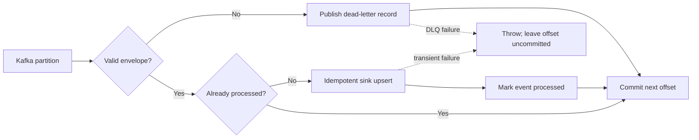

# Kafka Consumer Reference

A clean-room TypeScript reference for failure-aware Kafka consumption. It demonstrates manual offset commits, per-partition ordering, bounded messages, schema validation, dead-letter handling, graceful shutdown, and an explicit idempotent-sink contract.

This repository contains no client topics, infrastructure addresses, message schemas, credentials, source history, or service integrations.

## Processing contract



An offset advances only after one of these outcomes:

- the event was already processed;
- the sink accepted the valid event and the idempotency store recorded it; or
- an invalid event was successfully written to the dead-letter topic.

Transient sink, store, and dead-letter failures are rethrown. The batch runner therefore does not commit past the failed message. Successfully handled messages may replay if a later message fails before the batch commit, so a production sink must upsert by `eventId` rather than perform a non-idempotent insert.

## Event envelope

```json
{
  "eventId": "evt-2026-0001",
  "eventType": "portfolio.page.crawled",
  "occurredAt": "2026-08-14T08:00:00Z",
  "payload": {
    "url": "https://example.org/guide",
    "title": "Guide"
  }
}
```

`eventId`, `eventType`, `occurredAt`, and object-shaped `payload` are required. Messages larger than `MAX_MESSAGE_BYTES` follow the dead-letter path without JSON parsing.

## Run it

Node.js 22 or newer and access to Kafka are required.

```bash
npm install
npm run verify
cp .env.example .env
set -a && source .env && set +a
npm run build
npm start
```

The default sink writes structured event summaries to standard output. Replace `ConsoleUpsertSink` with a database adapter whose write is an upsert keyed by `eventId`. The in-memory idempotency store is illustrative and does not survive restarts; use durable storage in a deployed service.

## Failure behavior

| Condition | Outcome | Offset behavior |
| --- | --- | --- |
| Valid new event | Sink upsert, then mark processed | Commit after the batch succeeds |
| Duplicate event | Skip sink | Commit after the batch succeeds |
| Invalid JSON/schema | Publish bounded DLQ record | Commit only after DLQ acknowledgement |
| Sink/store failure | Throw | Do not commit the batch |
| DLQ publication failure | Throw | Do not commit the batch |
| Stale/stopped batch | Stop processing | Do not commit unprocessed messages |

## Verification

```bash
npm run verify
```

The tests use fakes rather than a Kafka broker. They cover success, duplicates, invalid input, oversized messages, sink failure, DLQ failure, full-batch commit, partial-batch failure, and stopped/stale batches. Passing them does not establish broker compatibility or production throughput.

## Design limits

- Delivery semantics are at-least-once, not exactly-once.
- The reference processes messages sequentially within a partition.
- Kafka broker authentication/TLS is deployment-specific and intentionally omitted.
- The example idempotency store is process-local.
- No payload is written to normal application logs.
- Dead-letter records include a bounded payload preview; apply domain-specific redaction before production use.

## License

[MIT](LICENSE)
